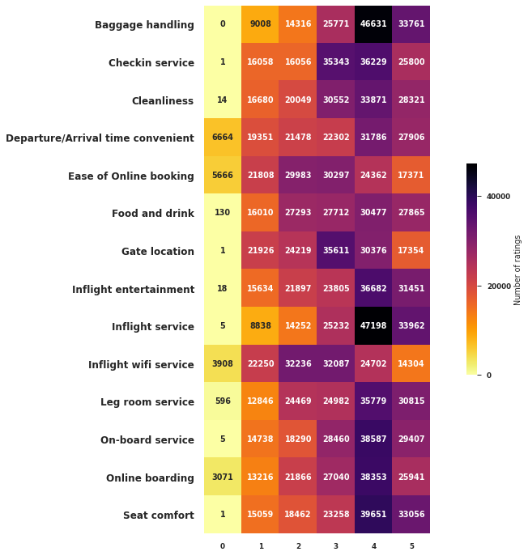

# Airline Satisfaction

This is a data analysis project regarding flight passenger data of US domestic flights.

*Florian Titze*, Data Analytics Bootcamp at Ironhack, Berlin July 2020

## Content
- [Project Description](#project-description)
- [Questions & Hypotheses](#questions-hypotheses)
- [Dataset & Data preparation](#dataset-data-preparation)
- [Analysis](#analysis)
- [Conclusions & ToDo](#conclusions-todo)
- [Workflow](#workflow)
- [Organization](#organization)
- [Limitations](#limitations)
- [Links](#links)

## Project Description

From the point of view of an airline, in order to optimize passenger satisfaction it can be important to survey passengers in different categories concerning their flight, such as *Age*, flown *class*, the *WiFi quality* on board or the perceived quality of the *Inflight service*. The goal of this project is to dive deep into a dataset containing such values, to find possible relationships between data, valuable insights which could be communicated to other departments within an airline, and ultimately examine whether passenger ratings in categories such as the above mentioned significantly contribute to passenger satisfaction.

## Questions & Hypotheses

* Visualize general statistics (what is the frequency of Age, flown distance etc.?)
* Analyzing the passenger frequency over age in more depth (at what age, who flies which class most?), does superimposing the satisfaction ratio for a given age result in interesting insights?
* In general, can EDA uncover arguments regarding the question whether external influences are at work which might contribute to satisfaction, but are not contained in the data?
* And ultimately: Which circumstances (reflected in this dataset by the passengers rating) contribute significantly to the overall satisfaction level of a passenger?

## Dataset & data preparation

The dataset was obtained from [kaggle](https://www.kaggle.com/teejmahal20/airline-passenger-satisfaction).

The data came split into **test** and **training** data, both as `.csv`-files. Since no ML was necessary right now, I initially merged the two. The resulting dataset had 24 columns and 129880 unique rows, one of the columns being a UID. Every row represented one passenger being asked.

## Analysis

### EDA

The EDA revealed several interesting insights. In the following, only a selection is mentioned. For more, please inspect the complete notebook.

Apart from visualizing different market shares for different age related target groups (passengers within the age of workforce fly more business, economy is flown mostly by people in their twenties), which can be communicated to the marketing or PR department for e.g. better targeted advertisement, one can see in the below histogram plot, that the ratio of passenger satisfaction wildly jumps at certain key ages (speculation: retirement age around 60 years old or at the age of 70 where insurance companies significantly raise contributions, etc.). A deeper analysis into these very age groups or adding more data could be beneficial to obtain knowledge regarding the origins of these effects.

Passengers rated **baggage handling** and **inflight service** most clearly. Also the means of the rating score seem comparable throughout all the categories, except **Inflight WiFi service** and **Ease of Online Booking** seem shifted slightly to worse ratings. An interesting finding, since we will later see that these are among those most significantly connected to passenger satisfaction.

Also worth noting is the almost negligible ammount of zero star votes. Examining this using additional data about cultural backgrounds could also lead to interesting findings - not necessarily from a business angle but maybe from a sociological point of view.

Within the notebook, all kinds of correlations were examined. In the end, with respect to the main research question, only the ones with the highest correlation were chosen, which were **Online Boarding**, **Seat comfort**, **Inflight Entertainment** and **Onboard Service**.

### Regression Model

A multiple linear regression model was set up to examine a significant effect between the **passenger satisfaction** as dependent variable and **Age**, **Online Boarding**, **Seat Comfort**, **Inflight Entertainment** and **On-board service** as independent variables, since these (escept Age) were the four variables with the highest correlation with satisfaction, shown during EDA.

## Conclusions & ToDo

* The model is of medium quality with regards to how much of the variance is explained. In fact only a third of the variability (*R²=0.348*) is explained by the model. Those values which can be explained by the model though are described fairly well. Each independent variable, **Online Boarding**, **Seat Comfort**, **Inflight Entertainment**, **On-board service** as well as **Age** do have a significant effect beyond just randomness (p-values all < 0.000) on the dependent variable **Is satisfied**. Although for example the passengers Age barely has any effect quantitatively, **an increase in one unit of rating in Online Boarding** (out of 5) according to the model **results in an increase of ca. 15% passenger satisfaction**. It must be noted, that here the model assumes satisfaction not as discrete variable in the same way in which the data are imported (satisfied = {1,0}), but as a continuous variable from 0 to 1 (0% and 100% respectively). The legitimacy of that assumption can be put into question though, since it is unclear how passengers would have rated satisfaction if they really were able to rate it from 0 to 100%.

* The sudden jumps in satisfaction at certain ages could indicate that there are external influences at work related to satisfaction. With regards to model significance and accuracy it could therefore be promising to calculate the OLS for the different age groups which set themselves apart from each other by these sudden jumps. A recommendation informed by such an analysis could pose valuable information for PR and marketing departments within an airline.

* Do passengers rate their experiences differently depending on which class they fly? One could make an OLS for each of the categories here as well.

## Workflow

1. Choosing a dataset suitable to derive a recommendation from it using OLS.
2. Formulating the overall research questions.
3. Import, clean and prepare the data
  * discarding 0.3% randomly occuring NaN values
  * creating dummy variables if necessary
4. Perform an EDA, always with respect to the question, what can the current newly gained knowledge mean for later assessing possible effects on **satisfaction**.
5. Set up the OLS, calculate results and write up recommendations.

## Organization

For this project, only rough tasks were written up for me personally, since it was a personal work. In hindsight, making use of a kanboard might have turned out supportive for the process.

## Limitations

Neither any source or date of origin is mentioned in the kaggle source for this dataset, which limits the real applicability of the formulated findings here beyond just the educational purpose.

## Links

* [Source of the dataset on kaggle.com](https://www.kaggle.com/teejmahal20/airline-passenger-satisfaction)

* [Google slides presentation](https://docs.google.com/presentation/d/1eoOu_bpFJgjXxqivmLKKIDXEaO_8hfE9F7H6mdePJuM/edit?usp=sharing)
